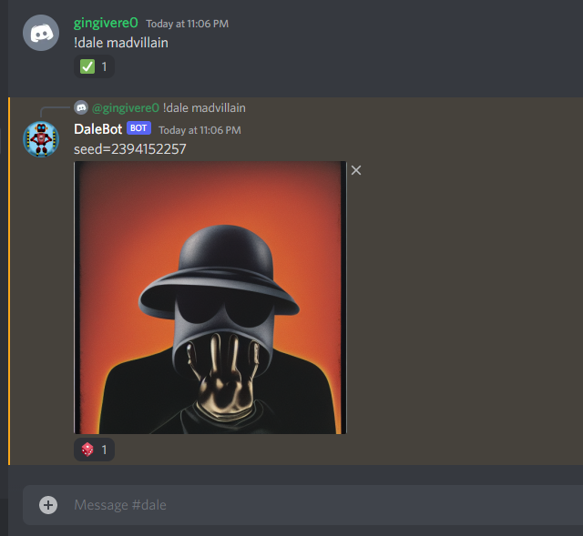
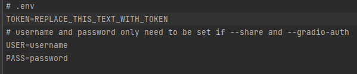

# Dalebot
A Discord bot which interfaces Discord messages with Stable Diffusion

## Features
- Type "!dale help" to get a list of supported arguments
- txt2img
- img2img
- upscale
- specify the seed
- set prompt conformity
- specify the number of samples
- negative prompts
- specify the number of images you'd like it to return
- specify the resolution
- specify denoising
- reply to a dalepost with "!dale" and more prompts, and dale will append those prompts onto the previous prompt(s)
- react to a dalepost with "🎲" to reroll the same prompt with a different seed
- specify up to 2 preset styles using style1 and style2 parameters (may add ability to save styles in a future update)
- change models using model="model name" parameter

## Requirements
- This isn't the AI. This is simply a bot that reads discord messages, feeds them into the AI, and returns the generated images back to discord.
- Make sure you have whatever the current version of [AUTOMATIC1111's Stable Diffusion AI Web UI](https://github.com/AUTOMATIC1111/stable-diffusion-webui) is.
- You MUST BE RUNNING the [AUTOMATIC1111's Stable Diffusion AI Web UI](https://github.com/AUTOMATIC1111/stable-diffusion-webui) locally at http://127.0.0.1:7860/.
- I'm using Python 3.10.7. Other versions of Python 3 may work, but I've only tested it on this version.
- Use [this guide](https://blog.ruanbekker.com/blog/2022/05/05/create-a-discord-bot-in-python/) to set up a discord bot if you don't know how.
	- Make sure the bot has permissions to:
		- Read Messages/View Channels
		- Send Messages
		- Send Messages in Threads
		- Embed Links
		- Attach Files
		- Add Reactions
		- Possibly others that I'm forgetting
	- You can stop following the linked guide when you get to the step where they're editing the .env file
	- Enable Message Content Intent (and maybe Presence Intent and Server Members Intent) under the Bot tab of the Discord Applications
- Clone this repository locally
- Generate and copy an OAuth2 Token for your bot. Create a text file in the repository called ".env". Its contents should look like this:
	- 
- Required python libraries (I installed with pip):
	- discord
	- python-dotenv
	- requests
	- pybase64
	- pillow
- Run the bot by typing "python bot.py" in the repository directory

	