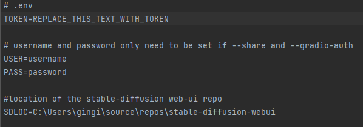

# Dalebot
A Discord bot which interfaces Discord messages with Stable Diffusion

## Requirements
- You MUST BE RUNNING the [Stable Diffusion AI](https://github.com/AUTOMATIC1111/stable-diffusion-webui) locally
- Use [this guide](https://blog.ruanbekker.com/blog/2022/05/05/create-a-discord-bot-in-python/) to set up a discord bot if you don't know how.
	- Make sure the bot has permissions to:
		- Read Messages/View Channels
		- Send Messages
		- Send Messages in Threads
		- Embed Links
		- Attach Files
		- Add Reactions
		- Possibly others that I'm forgetting
	- You can stop following the linked guide when you get to the step where they're editing mc_discord_bot.py
- Clone this repository locally
- Generate and copy an OAuth2 Token, create a file in the repository called ".env". Its contents should look like this:
	- 
- Required python libraries (I installed with pip):
	- discord
	- python-dotenv
	- requests
	- pybase64
	- pillow
	